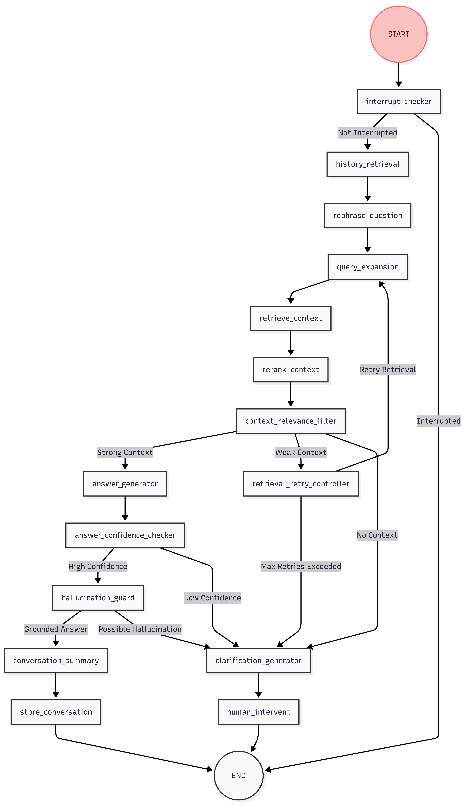

# ChatWithDoc – RAG on Documents

A Question Answering system over PDF / DOCX / text documents, built on top of LangGraph, FastAPI and a modular domain‑driven architecture. The system lets you upload documents, indexes them into OpenSearch, and then runs a guarded RAG pipeline to answer questions with conversation history, confidence checks, and hallucination protection.


## 1. Running the project with Docker Compose

1) Copy `.env.example` to `.env` and adjust values as needed (ports, DB credentials, OpenSearch, MinIO, LLM provider keys, etc...) ensure your LLM / embedding provider keys are set so the LangGraph pipeline can run end‑to‑end.
2) From the project root:

```bash
docker compose up --build
```

This will start:
* **chatwithdoc** – FastAPI backend exposing the RAG and document indexing APIs on port `8000`.
* **frontend** – Web UI for chatting with your documents on port `3000`. (Heavily vibe-coded)
* **postgres** – Conversation and metadata store.
* **opensearch** – Vector + keyword search index for document chunks.
* **minio** – S3‑compatible object storage for raw uploaded documents.

3) Access the interface at `http://localhost:3000`


## 2. LangGraph execution graph for ChatWithDoc

The ChatWithDoc pipeline is orchestrated using a LangGraph `StateGraph` over a shared `GraphState`. Each node reads and writes parts of the state and routing functions decide the next node based on intermediate results.




## 3. Repository architecture

The project is structured as a set of reusable infrastructure libraries under `libs` and a ChatWithDoc application under `services/chatwithdoc`, following a domain‑driven and layered design.

## 4. ChatWithDoc service (`services/chatwithdoc`)

The main RAG application lives under `services/chatwithdoc` and is divided into **API**, **Application**, and **Domain** layers.

* **API layer (`services/chatwithdoc/api`)**: defines HTTP endpoints (for example, chat with documents, upload documents, health checks) and wires them to application services.

* **Application layer (`services/chatwithdoc/application`)**: 
  * Builds the LangGraph execution graph (nodes, edges, and routing) for the ChatWithDoc pipeline.
  * Orchestrates the ingestion pipeline for uploaded documents

* **Domain layer (`services/chatwithdoc/domain`)**
  * Encapsulates the business logic responsible for each node in the RAG graph. Each submodule generally exposes an input model, an output model, and a service class that operates on them (without tying to HTTP or persistence concerns).


## 5. Future works:

* Support scanned PDF files through OCR models, combining with Neo4j to extract them into meaningful knowledges

## 6. Credits

* **Cursor**: This repository’s architecture, LangGraph execution graph implementation, and documentation were iteratively refined with assistance from the Cursor AI coding agent.
